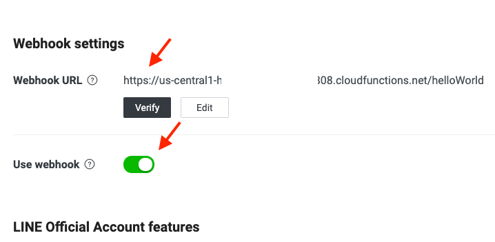
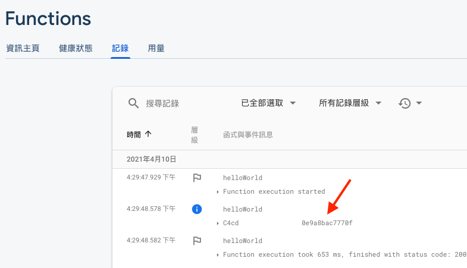
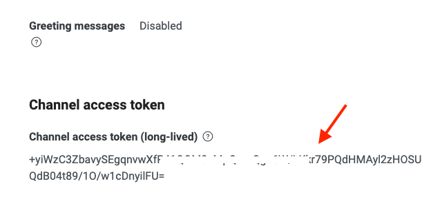

[](https://github.com/custom-components/hacs)

# line-bot

LINE bot plugin for Home Assistant

This project is modified from [yun-s-oh/Homeassistant](https://github.com/yun-s-oh/Homeassistant)

## ⚠ Note

This component is for LINE bot

If you plan to integrate LINE Notify, use yun-s-oh's component instead

## Usage

### Configuration

Add following entry in your `configuration.yaml`

```yaml

notify:
  - name: line_bot
    platform: line-bot
    client_id: 'CLIENT_ID'
    access_token: 'CHANNEL_ACCESS_TOKEN'  

```

See [Additional Information](#additional-information) for detail of retrieving `client_id` and `access_token`

### Call Service

```yaml
service: notify.line_bot
data:
  message: >-
    {"type": "text","text": "Hello, world"}
```

See [Additional Information](#additional-information) for detail of LINE Message Object


## Additional Information

### client_id

> `client_id` is LINE user ID or group ID

Retrieve `client_id` can be tricky, here's how I get `client_id`

1. Create Firebase [Cloud Functions](https://console.firebase.google.com/)
2. Deploy following script to Cloud Functions

```js
const functions = require('firebase-functions');

exports.helloWorld = functions.https.onRequest((request, response) => {
  const events = request.body.events
  const source = events.length > 0 ? events[0].source : null;

  if (source) {
    functions.logger.info(source.groupId || source.userId);
  }
  response.send("Hello from Firebase!");
});
```

3. Enable webhook for LINE Messaging API

4. Friend bot account or invite bot to your group chat
5. You should be able to see `client_id` in Cloud Functions log after sending some nice message to your bot

6. Disable webhook again or your log will be flooded


### access_token

> `access_token` is channel access token which can be generate from LINE Developer website

Visit `https://developers.line.biz/console/channel/<YOUR CHANNEL ID>/messaging-api`

The token is listed under `Channel access token` or your can create one there


### LINE Message Object

This component supports all kinds of message types that are listed in [Messaging API reference](https://developers.line.biz/en/reference/messaging-api/#message-objects)

Text message example

```json
{
  "type": "text",
  "text": "Hello, world"
}
```

Flex message example

```json
{
  "type": "flex",
  "altText": "this is a flex message",
  "contents": {
    "type": "bubble",
    "body": {
      "type": "box",
      "layout": "vertical",
      "contents": [
        {
          "type": "text",
          "text": "hello"
        },
        {
          "type": "text",
          "text": "world"
        }
      ]
    }
  }
}
```

#### See Also

[Flex Message Simulator](https://developers.line.biz/flex-simulator/) to help you build flex message object

## License

The project is licensed under MIT License.

See [LICENSE](LICENSE) for detailed infomation.
